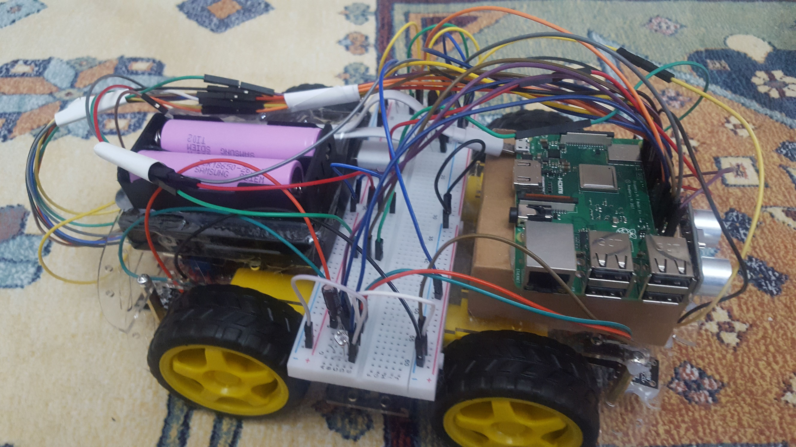
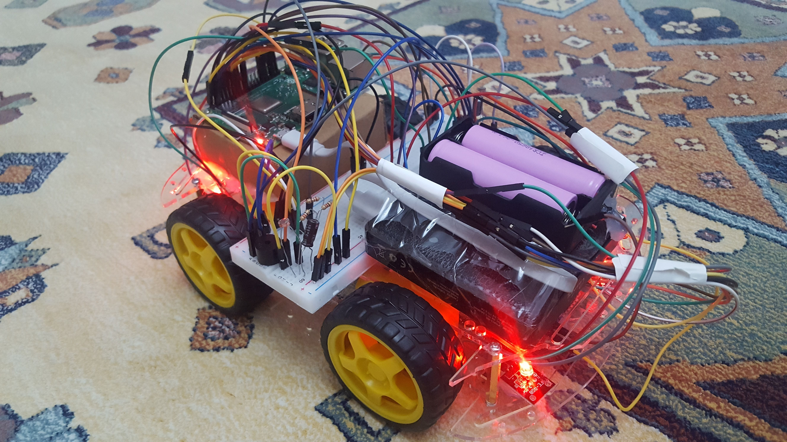
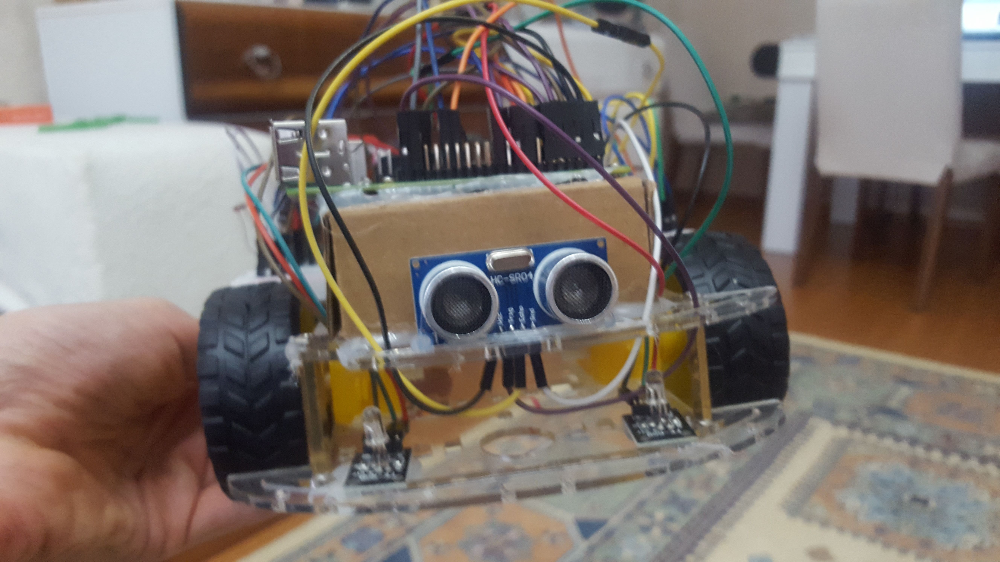
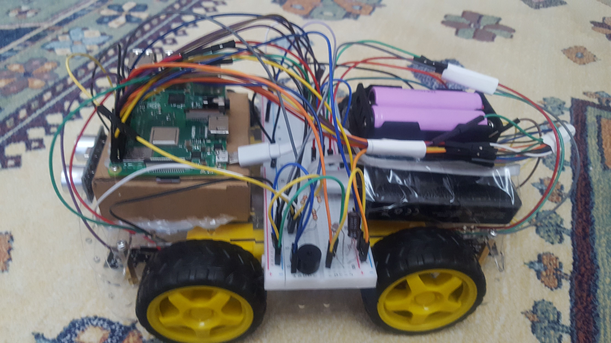
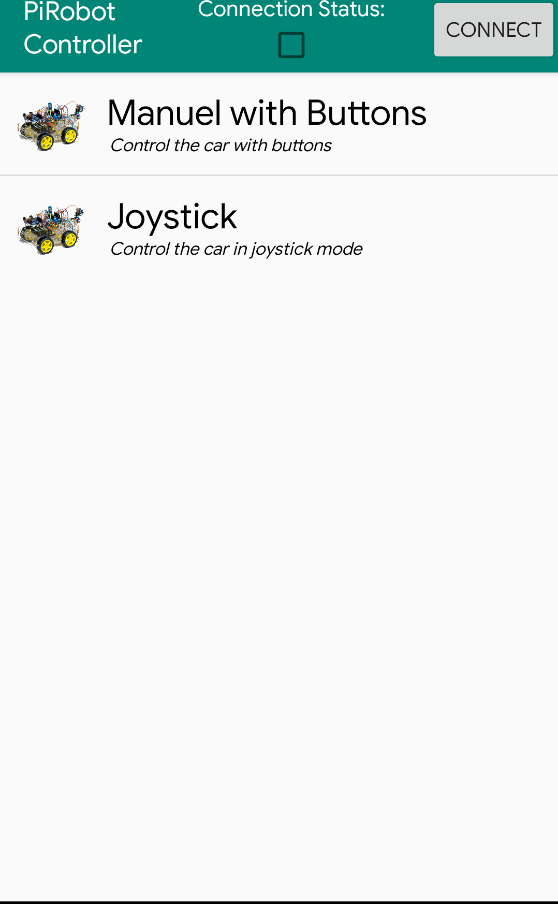
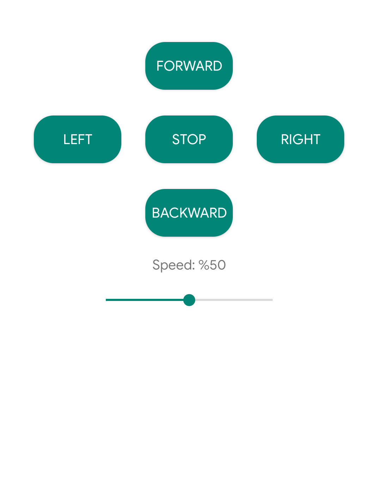
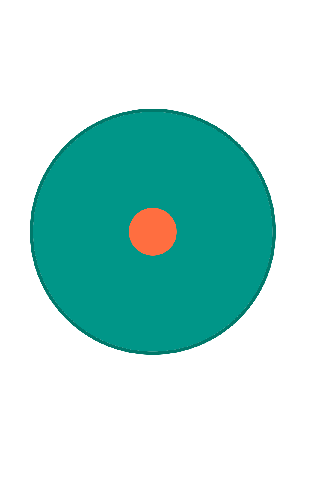
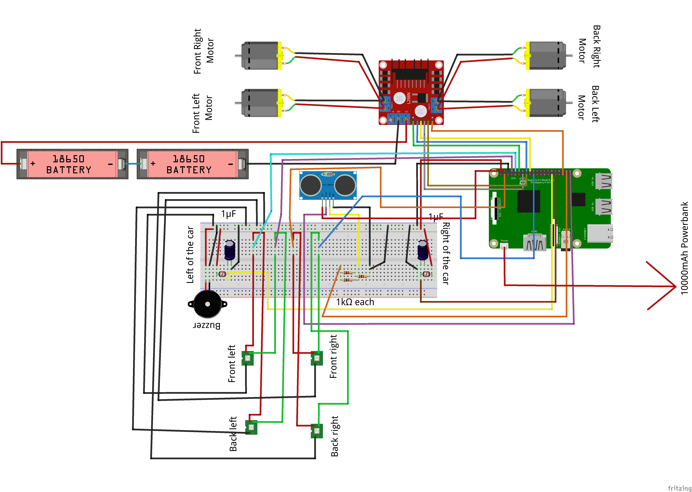

# PiRobot
Raspberry Pi Robot Car Project 

## Resimler / Images

### Car / Araba 

### Android 

## Circuit / Devre 

## Description (See Below for Turkish )

* In this project I built a raspberry pi robot car using python and android java. For android source code go to other repo:
* https://github.com/srknzl/PiRobotAndroidController

## Video of the running car  
* https://www.youtube.com/watch?v=-v0Dy22UOR8

### The car consists of

* 4wd multi purpose robot platform
* Four dc motor
* 1 hc-sr04 ultrasonic distance sensor
* 2 ldrs
* 2 1microfarad capacitor(used for light sensor, according to decharge time)
* Too many jumper cables
* 1 lm393n motor driver
* 1 raspberry pi 3 b+
* 1 buzzer
* Several 1k resistors
* 4 smd rgb led
* 1 powerbank for raspberry pi(could not power pi through gpio, OS do not boot)
* 2  Samsung Icr18650-26Jm 2600 Mah Li-İo battery
* 1 battery box for 18650

### Software 
* For raspberry pi, used python with gpiozero and PyBluez libraries. 

 

## Açıklama

## Türkçe çalışma videosu
* https://www.youtube.com/watch?v=Fa0YCz2Fe-I

* Bu projede robot araba yaptım. Android uygulamasıyla arabamı kontrol ettim. Android uygulama reposu linki:
* https://github.com/srknzl/PiRobotAndroidController

### Arabada kullanılanlar
* 4 tekerli çok amaçlı robot platformu
* 4dc motor
* 1 hc-sr04 ultrasonik mesafe sensörü
* 2 ışığa bağlı direnç
* 2 tane 1 mikro farad kapasitör(ışık sensörü için, deşarj süresine göre)
* Bir sürü jumper kablo
* 1 lm393n motor sürücü
* 1 raspberry pi 3 b+
* 1 buzzer
* Birkaç 1k lık resistör
* 4 tane smd rgb led
* 1 adet powerbank(gpio pinlerinden güç veremedim, işletim sistemi açılmadı)
* 2 adet samsung li-ion 18650 pil (Samsung Icr18650-26Jm 2600 Mah Li-İon Şarjlı Pil (2C))
* 1 adet 18650 pil kutusu 

### Yazılım
* Raspberry pi kısmını python kullanarak yaptım, PyBluez, gpiozero kütüphanelerinden faydalanıldı.

